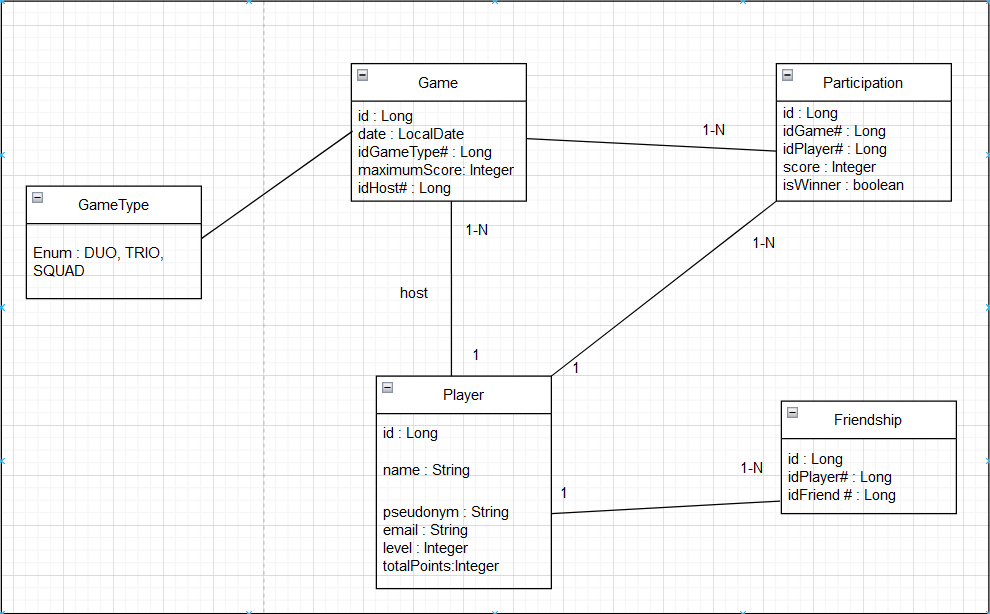

# Table of Content

- [A. Endpoints](#Endpoints)
  - [Player Management](#Player-Management)
  - [Game Management](#game-management)
- [B. Business Logic](#business-logic)
  - [Reason to have an interface for each service](#reasons-to-have-an-interface-for-each-service)
  - [Common Logic](#common-logic)
  - [Player Management](#player-management-1)
  - [Game Management](#game-management-1)
- [C. Database](#database)
  - [Schema](#schema)
  - [Database Structure](#structure)
  - [Database Creation](#database-creation)
- [D. How it works](#how-it-works)
  - [Backend workflow](#1-backend-workflow)
  - [Database workflow](#2-database-workflow)
  - [End-to-end worfklow](#3-end-to-end-workflow)
-[E. Tests](#tests) 
-[F. How to run code and tests](#how-to-run-code-and-tests)

# Endpoints 

## Player Management

#### 1. Create a New Player
- **URL**: `localhost:8081/players/create`
- **Request Type**: POST
- **Request Parameters**:
  - **Body** (JSON):  
    ```json
    {
      "name": "Player Name",
      "email": "player@example.com",
      "pseudonym": "PlayerPseudonym"
    }
    ```
    *(Fields for `CreatePlayerDTO`)*
- **Responses**:
  - **201 Created**:  
    ```json
    {
      "id": 1,
      "name": "Player Name",
      "email": "player@example.com",
      "pseudonym": "PlayerPseudonym"
    }
    ```
  - **400 Bad Request**:  
    - `"There is already a player with this email"`
    - `"There is already a player with this pseudonym"`
    - Validation errors (e.g., missing required fields).
  - **500 Internal Server Error**: Error with the player creation.

---

#### 2. Delete a Player by ID
- **URL**: `localhost:8081/players/delete/{id}`
- **Request Type**: DELETE
- **Request Parameters**:
  - **Path**: `id` (Long) - ID of the player to delete.
- **Responses**:
  - **200 OK**:  
    ```
    "Player was deleted successfully"
    ```
  - **404 Not Found**:  
    ```
    "Player with ID {id} not found"
    ```
  - **500 Internal Server Error**: Error with the player deletion.

---

#### 3. Get Player Information by ID
- **URL**: `localhost:8081/players/get/{id}`
- **Request Type**: GET
- **Request Parameters**:
  - **Path**: `id` (Long) - ID of the player to retrieve.
- **Responses**:
  - **200 OK**:  
    ```json
    {
      "id": 1,
      "name": "Player Name",
      "email": "player@example.com",
      "pseudonym": "PlayerPseudonym",
      "friends": [
        {
          "id": 2,
          "name": "Friend Name"
        }
      ]
    }
    ```
  - **404 Not Found**:  
    ```
    "Player with ID {id} not found"
    ```
  - **500 Internal Server Error**: Error while retrieving the player.

---

#### 4. Update Player Information by ID
- **URL**: `localhost:8081/players/update/{id}`
- **Request Type**: PUT
- **Request Parameters**:
  - **Path**: `id` (Long) - ID of the player to update.
  - **Body** (JSON):  
    ```json
    {
      "name": "Updated Name",
      "email": "updated_email@example.com",
      "pseudonym": "UpdatedPseudonym"
    }
    ```
    *(Fields for `UpdatePlayerDTO`)*
- **Responses**:
  - **200 OK**:  
    ```json
    {
      "id": 1,
      "name": "Updated Name",
      "email": "updated_email@example.com",
      "pseudonym": "UpdatedPseudonym"
    }
    ```
  - **400 Bad Request**:  
    - `"Please provide an email, a name, or a pseudonym to update"`
    - Validation errors (e.g., missing or invalid parameters).
  - **500 Internal Server Error**: Error while updating the player.

---

#### 5. Update Player Statistics by ID
- **URL**: `localhost:8081/players/update/stats/{id}`
- **Request Type**: PUT
- **Request Parameters**:
  - **Path**: `id` (Long) - ID of the player to update statistics for.
  - **Body** (JSON):  
    ```json
    {
      "points": 150
    }
    ```
    *(Fields for `UpdatePlayerStatisticsDTO`)*
- **Responses**:
  - **200 OK**:  
    ```json
    {
      "id": 1,
      "name": "Player Name",
      "level": 1,
      "totalPoints": 50
    }
    ```
  - **500 Internal Server Error**: Error while updating the player's statistics.

---

#### 6. Add a New Friend
- **URL**: `localhost:8081/friends/add`
- **Request Type**: POST
- **Request Parameters**:
  - **Query Parameters**:
    - `idPlayer` (Long): ID of the player adding the friend.
    - `idFriend` (Long): ID of the friend to add.
- **Responses**:
  - **201 Created**:  
    ```
    "Friendship created successfully"
    ```
  - **400 Bad Request**:  
    - `"Player with ID {idPlayer} does not exist"`
    - `"Player with ID {idFriend} does not exist"`
    - `"These players are already friends"`

---

#### 7. Remove a Friend
- **URL**: `localhost:8081/friends/delete`
- **Request Type**: DELETE
- **Request Parameters**:
  - **Query Parameters**:
    - `idPlayer` (Long): ID of the player removing the friend.
    - `idFriend` (Long): ID of the friend to remove.
- **Responses**:
  - **200 OK**:  
    ```
    "Friendship removed successfully"
    ```
  - **400 Bad Request**:  
    - `"Player with ID {idPlayer} does not exist"`
    - `"Player with ID {idFriend} does not exist"`
    - `"These players are not friends"`

---

#### 8. List Friends of a Player
- **URL**: `localhost:8081/friends/list`
- **Request Type**: GET
- **Request Parameters**:
  - **Query Parameters**:
    - `idPlayer` (Long): ID of the player whose friends are to be listed.
- **Responses**:
  - **200 OK**:  
    ```json
    [
      {
        "id": 2,
        "name": "Friend 1",
        "email": "friend1@example.com",
        "pseudonym": "FriendPseudonym1"
      },
      {
        "id": 3,
        "name": "Friend 2",
        "email": "friend2@example.com",
        "pseudonym": "FriendPseudonym2"
      }
    ]
    ```
  - **400 Bad Request**:  
    - `"Player with ID {idPlayer} does not exist"`

---

## Game Management

#### 1. Create a New Game
- **URL**: `localhost:8080/games/create`
- **Request Type**: POST
- **Request Parameters**:
  - **Body** (JSON):  
    ```json
    {
      "name": "Game Name",
      "gameType": "TRIO",
      "idHost": 1,
      "maximumScore": 100
    }
    ```
    *(Fields for `CreateGameDTO`)*
- **Responses**:
  - **201 Created**:  
    ```json
    {
      "id": 1,
      "name": "Game Name",
      "gameType": "TYPE_A",
      "idHost": 1,
      "maximumScore": 100,
      "gameDate": "2024-12-12"
    }
    ```
  - **400 Bad Request**:  
    - `"The game type has to be one of the following: [DUO, TRIO, SQUAD]"`
    - `"There is no player with this id: {idHost}"`
    - Validation errors (e.g., missing or invalid fields).
  - **500 Internal Server Error**: Error with the game creation.

---

#### 2. Update Game Information by ID
- **URL**: `localhost:8080/games/update/{id}`
- **Request Type**: PUT
- **Request Parameters**:
  - **Path**: `id` (Long): ID of the game to update.
  - **Body** (JSON):  
    ```json
    {
      "gameType": "SQUAD",
      "maximumScore": 150
    }
    ```
    *(Fields for `UpdateGameDTO`)*
- **Responses**:
  - **200 OK**:  
    ```json
    {
      "id": 1,
      "name": "Game Name",
      "gameType": "SQUAD",
      "idHost": 1,
      "maximumScore": 150,
      "gameDate": "2024-12-12"
    }
    ```
  - **400 Bad Request**:  
    - `"Game with ID {id} does not exist"`
    - `"Please provide a Game Type or Maximum Score to update"`
    - Validation errors (e.g., invalid fields).
  - **500 Internal Server Error**: Error while updating the game.

---

#### 3. Delete a Game by ID
- **URL**: `localhost:8080/games/delete/{id}`
- **Request Type**: DELETE
- **Request Parameters**:
  - **Path**: `id` (Long): ID of the game to delete.
- **Responses**:
  - **200 OK**:  
    ```
    "Game was deleted successfully"
    ```
  - **400 Bad Request**:  
    ```
    "Game with ID {id} does not exist"
    ```
  - **500 Internal Server Error**: Error with the game deletion.

---

#### 4. Get Game Information by ID
- **URL**: `localhost:8080/games/get/{id}`
- **Request Type**: GET
- **Request Parameters**:
  - **Path**: `id` (Long): ID of the game to retrieve.
- **Responses**:
  - **200 OK**:  
    ```json
    {
      "id": 1,
      "name": "Game Name",
      "gameType": "TYPE_A",
      "idHost": 1,
      "maximumScore": 100,
      "gameDate": "2024-12-12"
    }
    ```
  - **400 Bad Request**:  
    ```
    "Game with ID {id} does not exist"
    ```
  - **500 Internal Server Error**: Error while retrieving the game.

---

#### 5. Create a New Participation
- **URL**: `localhost:8080/participations/create`
- **Request Type**: POST
- **Request Parameters**:
  - **Body** (JSON):  
    ```json
    {
      "idGame": 1,
      "idPlayer": 2,
      "score": 100,
      "winner": true
    }
    ```
    *(Fields for `CreateParticipationDTO`)*
- **Responses**:
  - **201 Created**:  
    ```json
    {
      "id": 1,
      "idGame": 1,
      "idPlayer": 2,
      "score": 100,
      "winner": true
    }
    ```
  - **400 Bad Request**:  
    - `"Game with ID {idGame} does not exist"`
    - `"Player with ID {idPlayer} does not exist"`
    - `"Player with ID {idPlayer} is already participating in the game with ID {idGame}"`
    - Validation errors (e.g., missing or invalid fields).
  - **500 Internal Server Error**: Error while creating the participation.

---


# Business Logic

## Reasons to have an interface for each service

1. **Abstraction**
   - Allows changing the implementation without affecting the dependent code.

2. **Flexibility and Scalability**
   - Enables multiple implementations (e.g. : mock services for testing or alternative logic).
   - Makes the system adaptable for future changes or extensions.

3. **Support for Unit Testing**
   - Interfaces allow the use of mock services to test controllers without relying on real service logic.

---

## Common Logic

- **Check Entity Existence**:
  - Almost all services verify the existence of entities before performing actions. This is done using `findById` methods in their respective DAOs. If the entity does not exist, an exception is thrown.
  
- **Data Mapping**:
  - `ModelMapper` is used to map entities to DTOs and vice versa. This approach eliminates the need to assign variables individually, which can be time-consuming if there are many fields
  
- **Database Interactions**:
  - All create, update, and delete operations rely on DAO functions like `save`, `findById`, and `deleteById`. This ensures consistent database access patterns across the application.

- **Validation**:
  - Validations, such as checking for duplicate entries or missing fields, are performed in service methods to ensure data integrity before interacting with the database.

- **Avoid Circular Dependencies**:
  - Shared methods like `checkIfPlayerExists` are centralized in `FriendService` to avoid duplication and potential circular dependencies in other services. The services should not be dependend in both way.


## Player Management

### Create Player

- The player's starting `level` and total `points` are both initialized to `0`. 

---

### Get Player

- When returning the friends list, it includes not only the pseudonym but all his details.

---

### Update Player Statistics

- The player's total points are incremented by the `points` provided in the `UpdatePlayerStatisticsDTO`.
- If the total points exceed the `AMOUNT_POINTS_TO_PASS_LEVEL`, the excess points are carried over, and the player's level is incremented by `1`.
- We don't verify if the player id exists because it is the `Game-Manager` who is sending us the statistics and it checks already the id.    
- It isn't possible to update the level directly as the level upgrade automatically every 100 points.

---

### Add Friend
- Creates two friendship entries to ensure bidirectional relationships:
    - `idPlayer -> idFriend`
    - `idFriend -> idPlayer`
- This makes it easier to handle the Friend table and it is very common to have the duplication of the friendship.  

  

## Game Management

### PlayerWebClientService
- Validates a player's existence using a REST call to the `/get/{id}` endpoint of the Player service.
- Updates a player's statistics by sending a PUT request to the `/update/stats/{id}` endpoint of the Player service. 

*Remark : I chose Web Client for the communication between game manager and player manager as it is not blocking like Rest Template but also because Rest Template does not receive any support anymore from spring.*

---

### GameService

- Does not create a participation during game creation to avoid circular dependencies between the `Game` and `Participation` services.
- Initializes the game date to the current date and ensures the game ID is `null` before saving to avoid database conflicts.

---

# Database

## Schema



## Structure

### Key Entities and Their Purpose
1. **Player**:
   - Represents users with attributes like `name`, `email`, and `pseudonym`.
   - Tracks player progression (`level` and `totalPoints`).

2. **Game**:
   - Represents individual games with attributes like `date`, `gameType`, and `maximumScore`.
   - The `idHost` field links each game to its hosting player.

3. **GameType**:
   - Enum table for valid game types (`DUO`, `TRIO`, `SQUAD`) to ensure consistency.

4. **Participation**:
   - Tracks player involvement in games, storing `score` and `isWinner` for performance evaluation.

5. **Friendship**:
   - Tracks bidirectional relationships between players, enabling social features.

---

### Relationships Between Tables
1. **Player ↔ Game** (`1-N`):
   - Tracks which player hosts each game.
2. **Player ↔ Friendship** (`1-N`):
   - Records friendships between players in a bidirectional manner.
3. **Player ↔ Participation** (`1-N`):
   - Links players to games they participate in and tracks their performance.
4. **Game ↔ Participation** (`1-N`):
   - Tracks all participants of a game and their individual statistics.
5. **Game ↔ GameType** (`1-N`):
   - Ensures all games have valid and predefined types.

---

## Database creation

### Application.properties

You don't have to create all tables and constraints with SQL queries. With JPA it is possible to fill them automatically. You just have to create your database first.  
Then you should add the following lines in your `application.properties` file :

```python  
spring.datasource.url=jdbc:postgresql://localhost:5432/java5project #Database location
spring.datasource.username=username  #Your database username
spring.datasource.password=password  #Your database password
spring.jpa.hibernate.ddl-auto=update #Activate automatically update
```

### SQL creation

If you want to create your database and tables with SQL you can write the following queries :  

```SQL
-- Create the database
CREATE DATABASE java5project;

-- Switch to the new database
\c java5project;

-- Create the schema
CREATE SCHEMA java5project;

-- Use the schema
SET search_path TO java5project;

-- Table: GameType (Enum)
CREATE TYPE game_type_enum AS ENUM ('DUO', 'TRIO', 'SQUAD');

-- Table: Player
CREATE TABLE player (
    id SERIAL PRIMARY KEY,
    name VARCHAR(255) NOT NULL,
    pseudonym VARCHAR(255) UNIQUE NOT NULL,
    email VARCHAR(255) UNIQUE NOT NULL,
    level INTEGER DEFAULT 0,
    total_points INTEGER DEFAULT 0
);

-- Table: Game
CREATE TABLE game (
    id SERIAL PRIMARY KEY,
    date DATE NOT NULL DEFAULT CURRENT_DATE,
    game_type game_type_enum NOT NULL,
    maximum_score INTEGER NOT NULL,
    id_host INTEGER NOT NULL,
    CONSTRAINT fk_game_host FOREIGN KEY (id_host) REFERENCES player (id) ON DELETE CASCADE
);

-- Table: Friendship
CREATE TABLE friendship (
    id SERIAL PRIMARY KEY,
    id_player INTEGER NOT NULL,
    id_friend INTEGER NOT NULL,
    CONSTRAINT fk_friendship_player FOREIGN KEY (id_player) REFERENCES player (id) ON DELETE CASCADE,
    CONSTRAINT fk_friendship_friend FOREIGN KEY (id_friend) REFERENCES player (id) ON DELETE CASCADE,
    CONSTRAINT friendship_unique UNIQUE (id_player, id_friend)
);

-- Table: Participation
CREATE TABLE participation (
    id SERIAL PRIMARY KEY,
    id_game INTEGER NOT NULL,
    id_player INTEGER NOT NULL,
    score INTEGER DEFAULT 0,
    is_winner BOOLEAN DEFAULT FALSE,
    CONSTRAINT fk_participation_game FOREIGN KEY (id_game) REFERENCES game (id) ON DELETE CASCADE,
    CONSTRAINT fk_participation_player FOREIGN KEY (id_player) REFERENCES player (id) ON DELETE CASCADE
);
```
--- 

# How it Works

## 1. Backend Workflow

The backend manages business logic, processes requests, and communicates with the database.

### a. API Layer (Controller)

The application exposes REST APIs for clients (e.g., frontend applications or external services) to interact with.

### b. Service Layer

Contains the core business logic and acts as a bridge between controllers and repositories.

### c. Repository Layer

Handles data access and queries to the PostgreSQL database using Spring Data JPA.

---

## 2. Database Workflow

The PostgreSQL database stores the `Player` entity and other relevant data.  
The database is accessed indirectly through the repository layer.

---

## 3. End-to-End Workflow


1. **Client Request**:  
   A client sends an HTTP request (e.g., `GET /api/players/{id}`).

2. **Controller**:  
   The controller receives the request and forwards it to the service layer.

3. **Service Layer**:  
   The service layer processes the request, applies business logic, and calls the DAO.

4. **DAO**:  
   The DAO (Data Access Object) interacts with the repository to handle detailed data operations.

5. **Repository**:  
   The repository interacts with the PostgreSQL database to fetch or modify data.

6. **Database**:  
   The database returns the requested data (e.g., a `Player` object).

7. **Response**:  
   The service converts the data into a DTO (Data Transfer Object) and sends it back to the controller, which returns an HTTP response to the client.

--- 

# Tests

## Testing Services

The **Service** layer was tested to validate the functionality of the business logic under various scenarios:

- **With Correct Values**: Ensured the services returned expected results for valid inputs.
- **With False Values**: Verified that services handled invalid inputs and edge cases appropriately.

### Tools and Techniques:
- **Mockito**: Used `@Mock` to simulate dependencies, ensuring isolation of the service logic.
- **JUnit Assertions**: Applied `assertEquals` to verify that the actual results matched the expected ones.
- **when()...thenReturn()**: Mocked the behavior of service dependencies to simulate various scenarios.

## Controller Testing
- **Correct Values**: Verify that controllers return the expected HTTP status codes and response bodies for valid requests.
- **False Values**: Test how controllers respond to invalid or incomplete requests, ensuring proper error handling and validation.

## Tools and Techniques
- **MockMVC**: Used to test HTTP requests and responses in isolation without starting the full application.
- **Mockito**: Mocked service dependencies to focus only on the controller's behavior.
- **JUnit Assertions**: Used to verify status codes and response contents.

---

# How to run code and tests

## 1. Start the Application
```bash
mvn spring-boot:run
```

## 2. Execute all tests
```bash
mvn test
```

## 3. Execute one test
```bash
mvn test -Dtest=ClassNameTest test
```